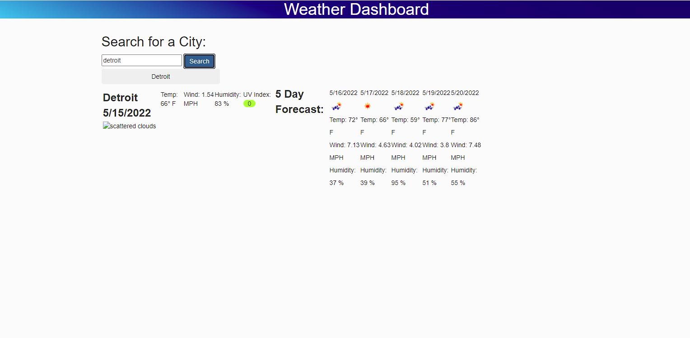

# Weather-Dash

## Table of Contents

*[What](#What)
*[Screenshot](#Screenshot)
*[What-I-Learned](#what-i-learned)
*[Link](#link)

## What

This is a simple weather dashboard. It makes use of the OneWeather API as well as html css and js. 
Inputting a city name will reutrn current conditions and a 5 day forecast. Searched citites should persist in local storage.

## Screenshots

## What I Learned

I learned how to really dig into documentation and api's. From going from zero expierience to being an expert at one, is a big deal for me.

## Link

https://bmkersey.github.io/Weather-Dash/
